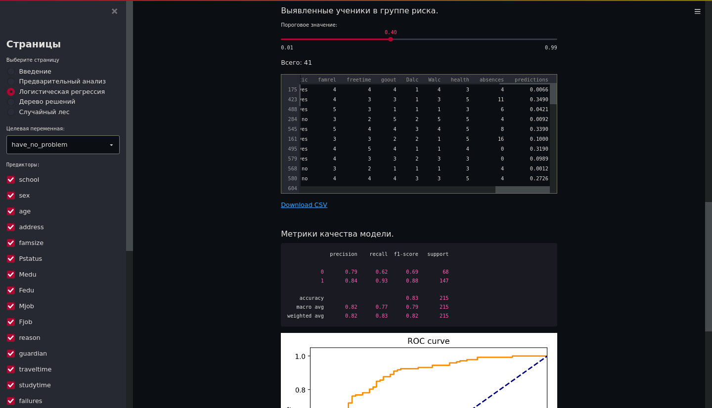
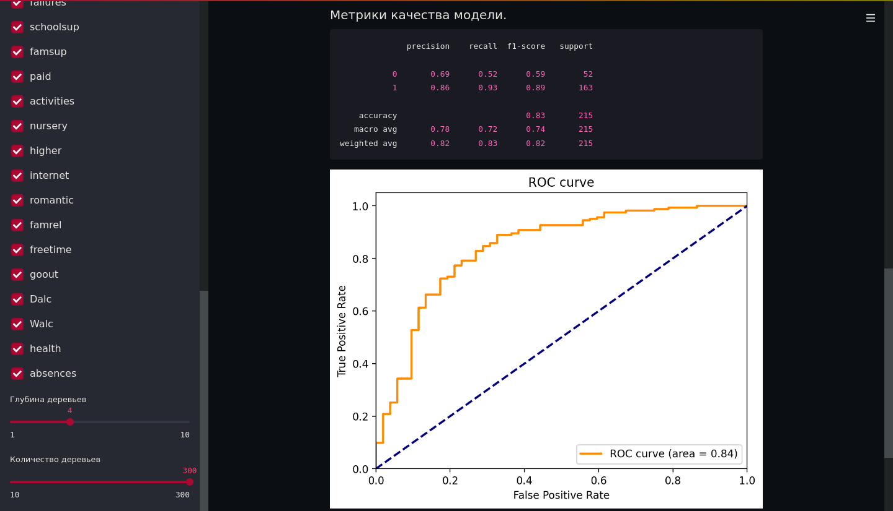

# performance_prediction

## Прототип рекомендательной системы для педагогов, помогающей обнаружить учеников в группе риска по успеваемости.

Live Demo: https://performance-prediction-1.herokuapp.com/

"Целью каждого учителя является максимально полное усвоение учебной программы его учениками. Для повышения качества обучения хорошей практикой было бы заблаговременное восполнение пробелов в знаниях до того, как отставание станет значительным. В условиях современной школы трудно заранее выявить учеников, которым необходимо уделить больше внимания и которым может потребоваться более подробное объяснение материала.

Потенциальные трудности можно предусмотреть, пользуясь примерами из предыдущей практики. Но на накопление достаточного багажа опыта могут потребоваться долгие годы, которых нет у молодых специалистов. Знания других педагогов могут помочь выти из сложившейся ситуации. Для этого на основе данных об учениках и об их успеваемости возможно построить систему, которая будет прогнозировать успеваемость исследуемых учащихся."

Автор: Даниил Муханов

## Установка

```sh
sudo docker-compose up
```


---

---



